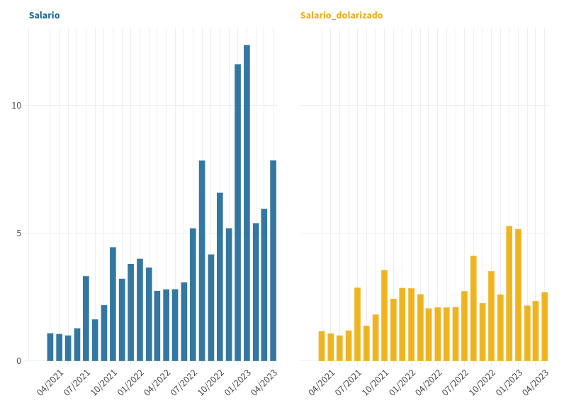
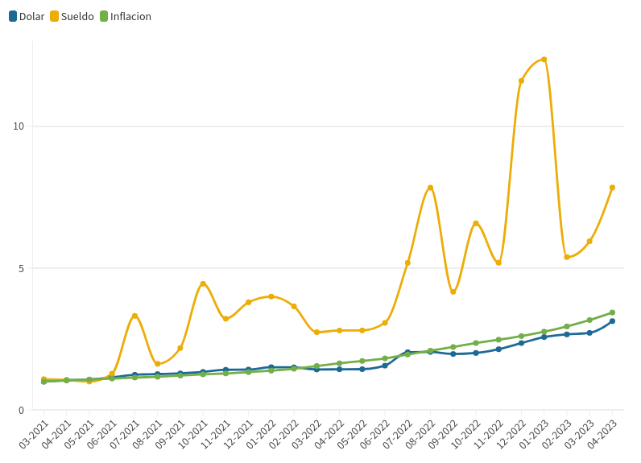
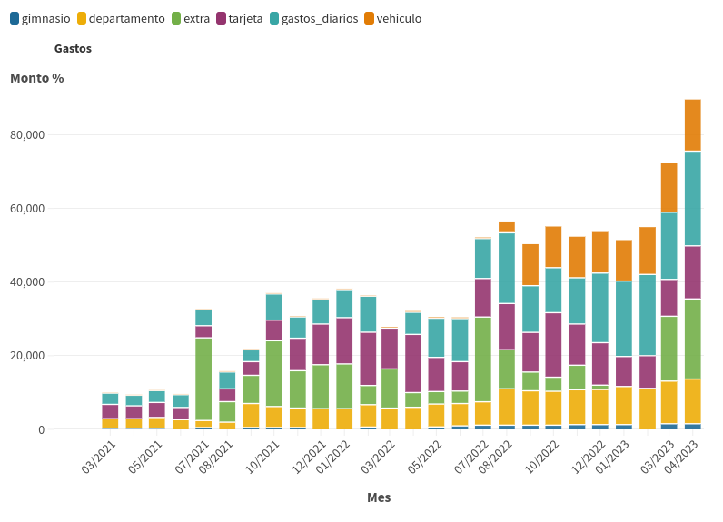
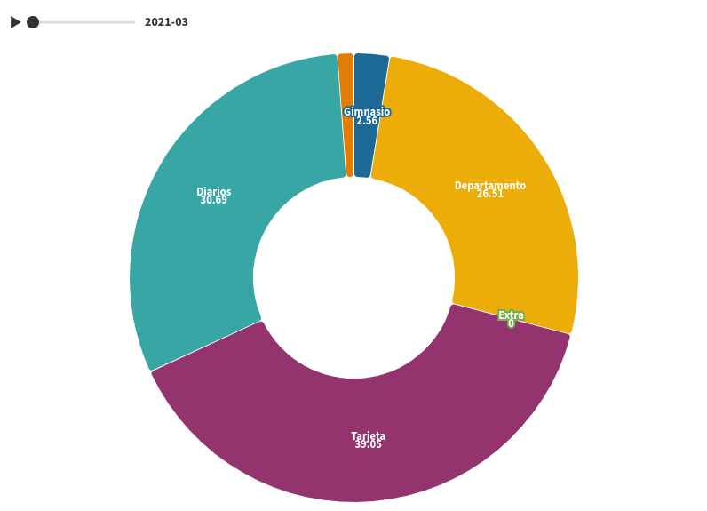
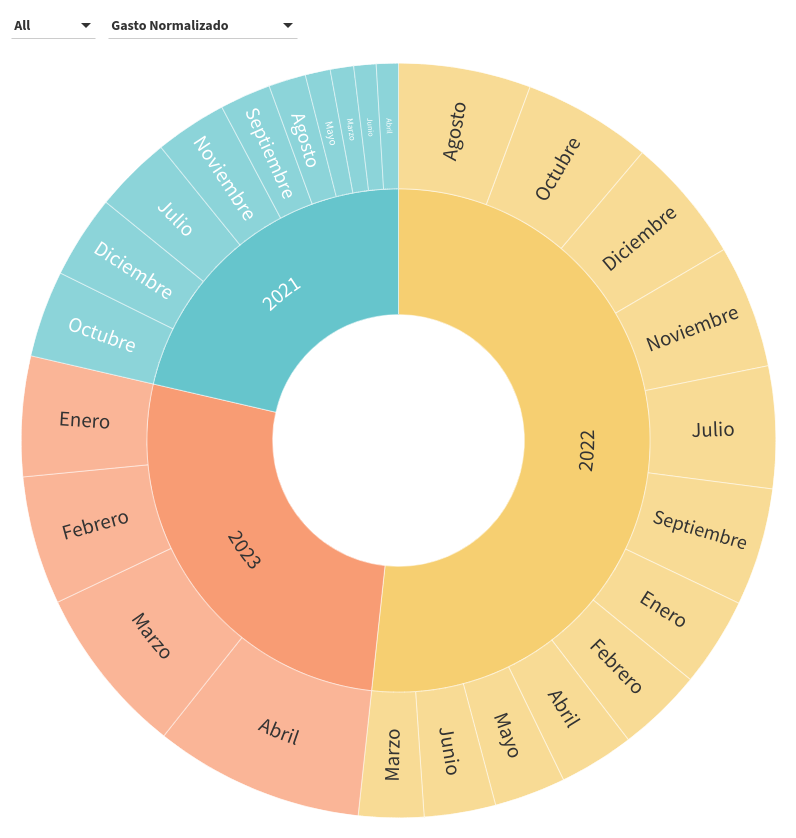

# infovis

## TP1-Datos Personales
El trabajo práctico consiste en utilizar un conjunto de datos con información personal, abarcando una historia de al menos una semana.

En este caso, se emplearon datos de salarios y gastos mensuales desde marzo de 2021 hasta abril de 2023. Para resguardar la privacidad, los montos fueron anonimizados. Para lograr esto, se dividieron los montos por el valor del salario más bajo del período, con el propósito de normalizar los valores y observar las variaciones en los salarios a lo largo del tiempo.

Por otro lado, se utilizó la siguiente página web, https://www.dolarito.ar/, para calcular el precio del dólar. Se extrajeron los valores máximos y mínimos de compra y venta para cada mes, y se calculó un promedio basado en esos cuatro valores.

Finalmente, se obtuvo la información sobre la inflación desde el siguiente sitio web: http://estudiodelamo.com/inflacion-argentina-anual-mensual/.

Variables observadas en las siguientes imágenes:
- Salario: sueldo mensual.
- Gimnasio: cuota mensual gimnasio.
- Departamento: gastos de alquiler y expensas.
- Tarjeta: gastos mensuales de tarjeta.
- Diarios: gastos comunes del día a día que no entran en el resto de las categorías.
- Vehículo: gastos relacionados con el auto. Cochera, seguro, patente y mantenimiento.
- Extra: gastos extraordinarios, compra de divisas, inversión, etc.

### 1-Salario normalizado en pesos y en dólares.

### 2-Gráfico de lineas: salario, Inflación, Precio Dolar.

### 3-Gráfico de columnas: salario descriminado por gastos mensuales.

### 4-Gráfico de torta: avance gastos mensuales en todo el período de estudio (2021-03 hasta 2023-04).

### 5-Gráfico Sunburst: gráfico de donas multianillo ampliable.

